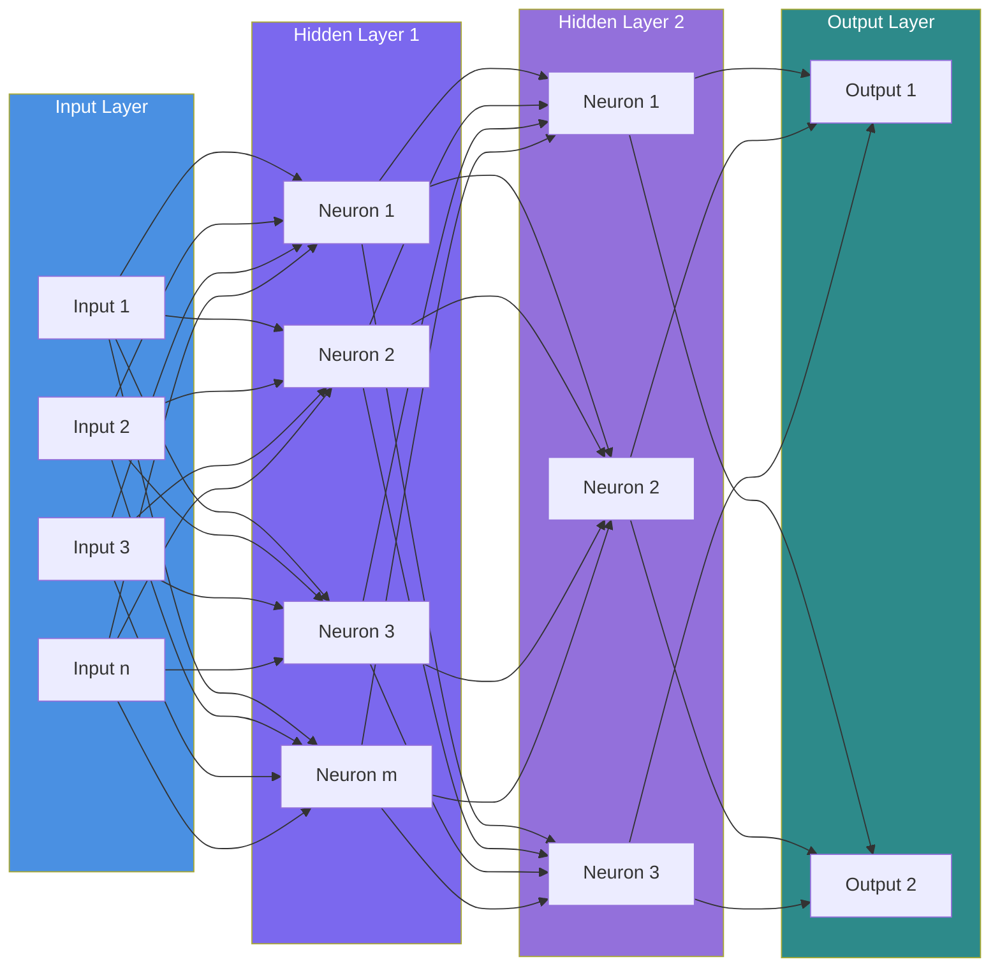
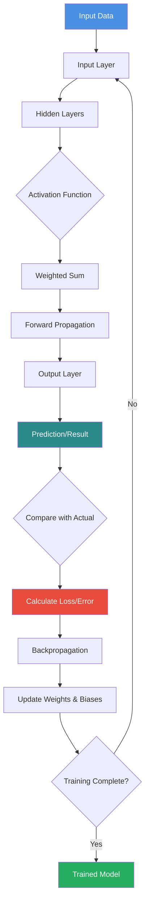
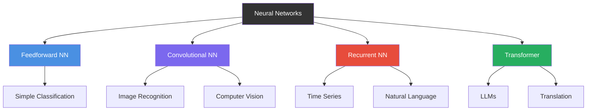

# Neural Networks

## Neural Network Structure

## How Neural Networks Work

## Neural Network Components

- **Input Layer**: Receives raw data (features)
- **Hidden Layers**: Process and transform data through weighted connections
- **Output Layer**: Produces final prediction or classification
- **Weights**: Determine strength of connections between neurons
- **Bias**: Allows shifting of activation function
- **Activation Function**: Introduces non-linearity (ReLU, Sigmoid, Tanh)
- **Forward Propagation**: Data flows from input to output
- **Backpropagation**: Error flows backward to update weights
- **Loss Function**: Measures prediction error

## Types of Neural Networks

# Source

- [IBM - Neural Networks](https://www.ibm.com/think/topics/neural-networks)