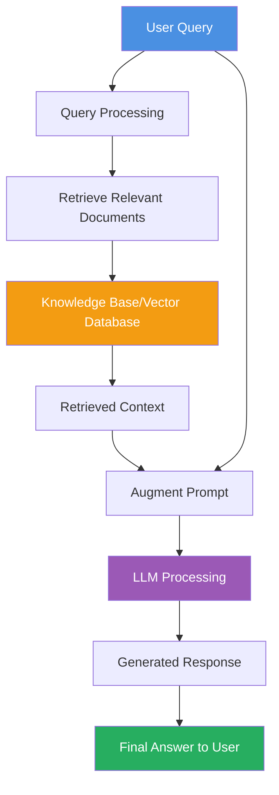

# Retrieval-Augmented Generation (RAG)

## What is Retrieval-Augmented Generation

- optimizing the output of a LLM
- referencing trusted knowledge base outside of the LLM training data
- combining pre-trained LLM with internal data source

### Benefits

- Accurate and up-to-date information
- Cost effective way to use LLM for your organization
- More developer control

## RAG Workflow

### How RAG Works

1. **User Query**: User submits a question or request
2. **Query Processing**: The query is processed and converted into a searchable format (often vector embeddings)
3. **Retrieve Relevant Documents**: Search the knowledge base for relevant information
4. **Knowledge Base**: Internal documents, databases, or vector stores containing organizational data
5. **Retrieved Context**: Relevant documents/snippets are extracted
6. **Augment Prompt**: Combine user query with retrieved context
7. **LLM Processing**: The augmented prompt is sent to the LLM
8. **Generated Response**: LLM generates an answer based on both its training and the retrieved context
9. **Final Answer**: User receives an accurate, context-aware response

Source: [AWS - RAG](https://aws.amazon.com/what-is/retrieval-augmented-generation/)

