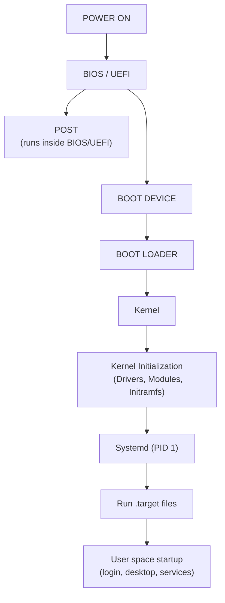

# Boot



**BIOS / UEFI**

- Firmware that initializes hardware and starts the boot process

**POST** (Power On Self Test)

- Tests all important hardware parts

**BOOT DEVICE**

- SSD, HDD, CD
  - System partition

**BOOT LOADER**

- GRUB2
- Is a part of the distribution (not Linux Kernel)

**Kernel**

- Core software that manages hardware, memory, and system resources

**Kernel Initialization**

- Load:
  - Device Drivers
  - Kernel Modules
  - Initramfs
- Mount the root filesystem
- Start the first user-space process (/lib/systemd/systemd)

**Systemd** is responsible for booting the user space and managing services:

- Acts as parent of all processes on Linux
- Mounts file systems and disks
- Launches background processes (networking, sound, & power management)
- Handles user logins
- Starts the desktop environment (if installed)

**.target files**
```
basic.target (Mounts filesystems)
  ↓
multi-user.target (Starts networking, login, SSH, etc.)
  ↓
graphical.target (if a desktop environment is installed)
```
