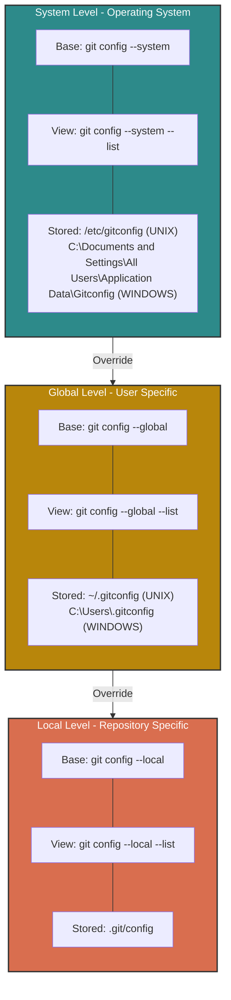

# Git Config

3 levels of git config hierarchy

## Level 1: System - Operating System

- **BASE:** `git config --system`
- **VIEW:** `git config --system --list`
- **Stored:** `/etc/gitconfig`

## Level 2: Global - User Specific

- **BASE:** `git config --global`
- **VIEW:** `git config --global --list`
- **Stored:** `~/.gitconfig`

## Level 3: Local - Repository Specific

- **BASE:** `git config --local`
- **VIEW:** `git config --local --list`
- **Stored:** `.git/config`
