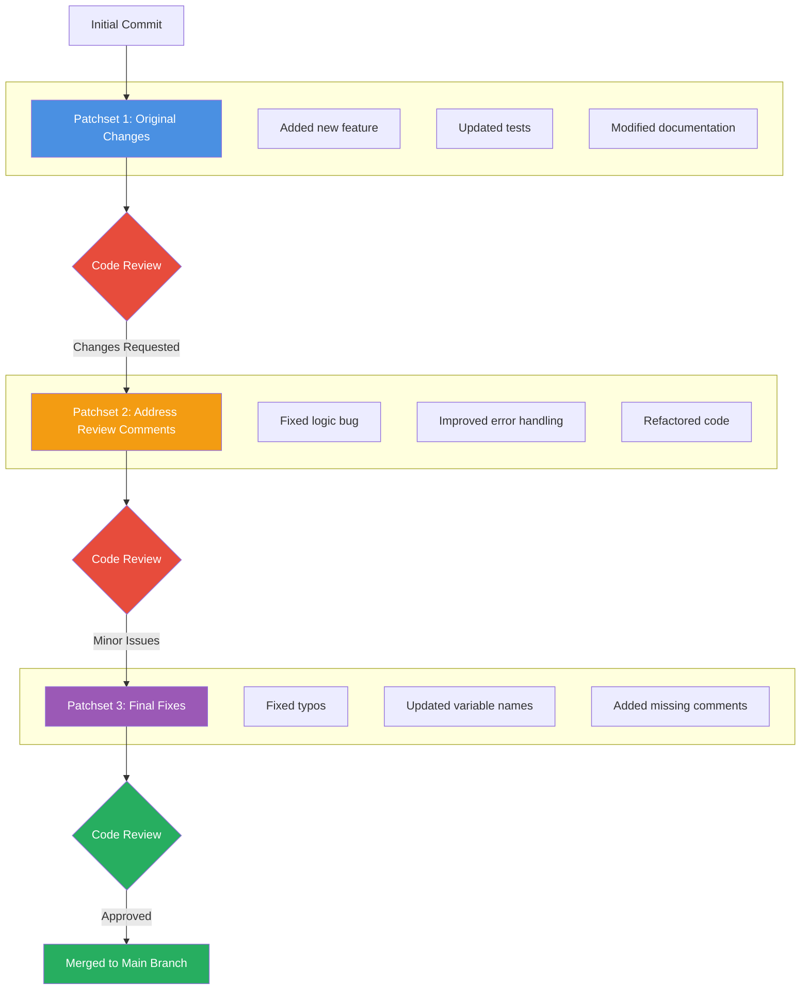

# Patchset

A patchset is a review mechanism used in version control systems, particularly in code review tools like Gerrit. It represents a collection of changes or modifications made to the codebase that are grouped together for review and approval before being merged into the main codebase.

Examples of patchsets:



## Patchset Workflow

1. **Patchset 1**: Developer submits initial changes
   - Contains the original implementation
   - Sent for code review

2. **Patchset 2**: Developer addresses review feedback
   - Fixes issues identified in review
   - Improves code quality
   - Same change ID, new patchset version

3. **Patchset 3**: Developer makes final adjustments
   - Addresses remaining minor issues
   - Polishes the changes
   - Ready for merge

Each patchset is a revision of the same change, maintaining the same Change-ID but incrementing the patchset number.

## Commands to push Patchsets

For Patchset 1

```bash
git add <files>
git commit -m "patchset 1 description"
git push
```

For Patchset 2 and beyond

```bash
git commit --amend -m "patchset 2 description"
# Or keep commit message from Patchset 1: git commit --amend --no-edit
git push
```