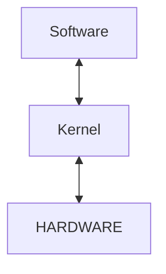

# Kernel

Kernel operates hardware on low level

Whenever you compile and run your C code, then the C-library uses system calls

It accepts system calls to perform functions

## Kernel is monolithic

- more built in to it compare to other kernels (Windows NT, MacOS)

- alot of included drivers
  - GPU
  - peripherals (pen tablets)
  - don't get option to edit/remove features (unless you compile the kernel yourself)

## Videos

[The Linux Kernel: What it is it](https://youtu.be/JDfo2Lc7iLU)

[Kernel to IoT](https://youtu.be/H8Q64gHNp6Y)
