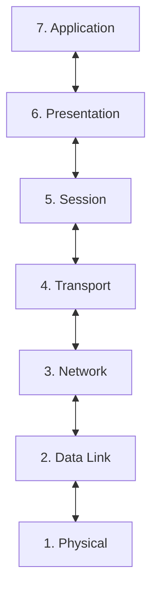

# OSI Model

## OSI Layers

### 7. Application

### 6. Presentation

### 5. Session

### 4. Transport

Transmits data using transmission protocols including TCP & UDP

### 3. Network

Decides which physical path the data will take.

Routing data and logical addressing (e.g. IP), determining the best path from source to destination across networks.

### 2. Data Link

Defines the format of data on the network

1. Receives data from physical layer
2. Checks for transmission errors
3. Packages bits to data frames (e.g.: `| MAC1 | MAC2 | IP1 IP2 Segment | FCS`)
4. Manages the physical addressing layer:
  - Media Access Control (MAC)
  - Logical Link Control (LLC)

### 1. Physical

Transmission and reception of raw bitstreams over a physical medium.

e.g.: network cable, power plug, wireless, pulses of light.

## Links

[What is OSI (video)](https://youtu.be/Ilk7UXzV_Qc)

[OSI Deep Dive (video)](https://youtu.be/oVVlMqsLdro)

[What is OSI (cloudflare)](https://www.cloudflare.com/en-gb/learning/ddos/glossary/open-systems-interconnection-model-osi/)
